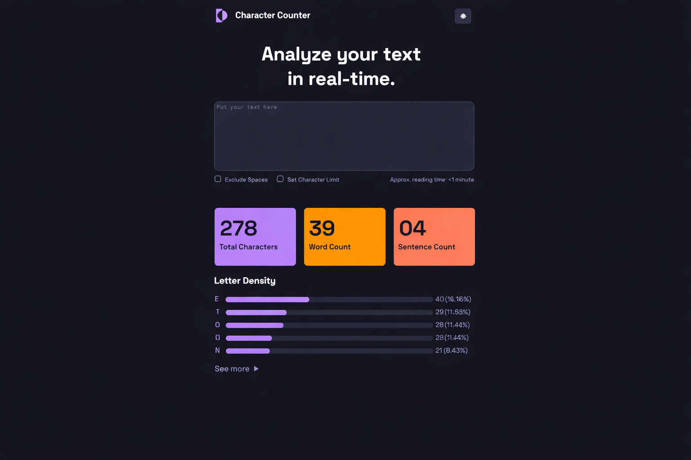

# Trabajo Práctico N1

## Objetivo del proyecto

El objetivo del proyecto era desarrollar una interfaz web inspirada en el diseño de referencia que nos entregaron. La idea era que el proyecto quede igual o muy similar al diseño de referencia. Para ello habia una consigna, tenía que tener buena distribucion visual, espaciados, colores, tipografia, bordes redondeados, tarjetas de estadísticas y debia poseer jerarquía visual.

## Tecnologías utilizadas

Para llevar a cabo el proyecto, se utilizaron las siguientes tecnologías:
-HTML
-CSS

### Index

En el index implementé el uso de section y divs para organizar el trabajo y poder clasificar todo, para poder asi estilarlo en el archivo css. Comence poniendo los titulos, los botones, para luego culminar con los inputs, el textarea y la seccion de métricas. El index esta compuesto por un section que engloba todo el cuerpo, para luego en el interior divirse con divs.

### CSS

El CSS arranqué poniendo la tipografia y poniendo el :root para agilizar el uso de los colores. Luego, comencé por el recuadro del cuerpo, cuando pude encuadrar el proyecto, arranqué a estilizar por orden, desde arriba hacia abajo, desde el título con el logo de la página, hasta el See More del final.

### Dificultades 

Tuve varias dificultades, como por ejemplo al estilizar el textarea, también tuve dificultades con los checkbox y su estilo, ya que al poner que su apariencia sea nula, me mareaba y no podia terminar de estilarlo de la mejor manera, la parte de resultados me fue fácil, pero las métricas del final fueron un poco tediosas a la hora de ponerles el color. Por suerte lo pude sacar adelante con la ayuda de compañeros, ya que debatiamos un poco en el grupo, y tambien con la ayuda de la IA, que me ha sido util a la hora de consultar acerca de ciertas cosas, dandome herramientas que no conocía/recordaba. Aún todas esas dificultades, me gustó el proyecto y siento que para un próximo trabajo voy a estar más preparado.

### Resultado Final

